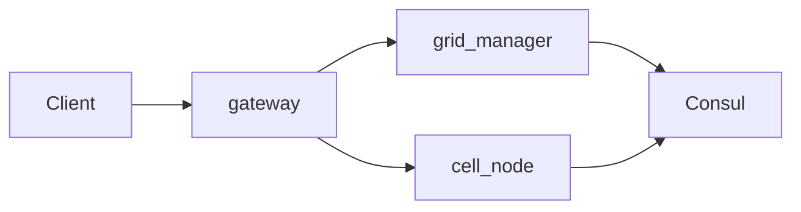

# Roadmap и чеклист MMO

Критерии готовности по фазам и **снимок состояния** стека — ниже.

| См. также | |
|-----------|--|
| Суперпроект (клон) | [full_mmo](https://github.com/Saske912/full_mmo) — `git@github.com:Saske912/full_mmo.git` |
| Индекс документации | [README.md](README.md) |
| Криптоэкономика (BET) | [crypto-economy.md](crypto-economy.md) |
| CI и деплой backend | [ci-and-deploy.md](../backend/docs/ci-and-deploy.md) |

**Пути:** Markdown-ссылки ниже считаются от каталога `docs/`. Фрагменты в обратных кавычках вроде `internal/ecs`, `deploy/terraform`, `scripts/…` без префикса — от **корня submodule [`backend/`](../backend/)** (Go‑модуль и Terraform staging). Каталог [`Unity/`](../Unity/) — отдельный submodule.

---

## MMO Backend Development & Deployment Checklist

---

## Снимок состояния (март 2026, обновлено 2026-03-29)

**Каноничный полный чеклист** ведётся только в этом файле суперпроекта (**`docs/roadmap-checklist.md`**). В репозитории **`mmo`** файл **`checklist.md`** — короткий указатель сюда (без дублирования фаз).

Этот раздел отражает **фактическое состояние репозитория MMO**, а не весь aspirational-чеклист ниже.

- **Стек:** Go, protobuf в `proto/`, ECS в `internal/ecs`, репликация в `internal/replic`, обнаружение сот в `internal/discovery` (Consul HTTP API, `hashicorp/consul/api`).
- **Деплой staging:** `scripts/deploy-staging.sh` (тесты → образ → Harbor → **`goose-migrate-job.sh`** при **`gateway_migrations.auto.tfvars`** с **`gateway_skip_db_migrations = true`** → OpenTofu), манифесты в `deploy/terraform/staging/`; env на gateway **`GATEWAY_SKIP_DB_MIGRATIONS`**. Образ содержит **`/migrate`**; отключить Job в пайплайне: **`STAGING_RUN_GOOSE_JOB=0`**. Пример/дубликат: [`gateway_migrations.auto.tfvars.example`](../backend/deploy/terraform/staging/gateway_migrations.auto.tfvars.example); Job-манифест — [`deploy/staging/goose-job.example.yaml`](../backend/deploy/staging/goose-job.example.yaml). Смоук `scripts/staging-verify.sh` (опционально **`STAGING_VERIFY_RESET_AUTO_CELLS=1`** — удалить runtime child `cell-node-auto-*` / `mmo-cell-auto-*` перед прогоном, если после `make split-e2e-smoke` разросся каталог; registry, **`gateway-api-smoke`**, smoke **`export-npc-persist`**, **`forward-update noop`**, **`split-prepare`**, **`split-drain`**, B2, resolve, ping, gateway **`/healthz`**/**`/readyz`**, ws-smoke). Перед **`split-e2e-smoke`**: предочистка по умолчанию — **`RESET_AUTO_CHILDREN_BEFORE_TEST=1`** в [`grid-auto-split-e2e.sh`](../backend/scripts/grid-auto-split-e2e.sh) (отключить: `=0`). Если **`tofu output -raw gateway_public_url`** не даёт строку с префиксом **`http://`** / **`https://`** (пустой state / предупреждения в выводе), скрипт берёт дефолт **`https://mmo.pass-k8s.ru`**; при смоуке можно задать **`GATEWAY_PUBLIC_URL`**. Опционально **`STAGING_VERIFY_READYZ_GOOSE_HEADER=1`** (наличие **`X-MMO-Goose-Version`**). Отдельно: **`make verify-readyz-goose`** / [`verify-gateway-readyz-goose.sh`](../backend/scripts/verify-gateway-readyz-goose.sh) (из корня суперпроекта, команды — в submodule `backend/`); после деплой-скрипта — **`STAGING_VERIFY_READYZ_GOOSE_AFTER_DEPLOY=1`**. **`migration-dry-run`:** **`STAGING_VERIFY_MIGRATION_DRY_RUN=incluster`** или [`mmoctl-in-cluster.sh`](../backend/scripts/mmoctl-in-cluster.sh). Опционально: **`STAGING_VERIFY_EXPECT_CELL_IDS`**, **`STAGING_VERIFY_RESOLVE_CHECKS`**, **`STAGING_VERIFY_MIGRATE_CELL`**. Лёгкая нагрузка на gateway: **`make load-smoke`** ([`gateway-session-burst`](../backend/scripts/gateway-session-burst/main.go)).
- **Staging, smoke (факт):** 2026-03-29 — **репозиторий `mmo` `main`**, образ в Harbor **`library/mmo-backend`** (тег в [`image.auto.tfvars`](../backend/deploy/terraform/staging/)); **`GET /readyz`** → **`X-MMO-Goose-Version: 20260429120000`** (миграция баланса [`20260429120000_balance_tutorial_scholar_rewards.sql`](../backend/internal/db/migrations/20260429120000_balance_tutorial_scholar_rewards.sql)); **`staging-verify.sh`** (+ опц. **`STAGING_VERIFY_READYZ_GOOSE_HEADER=1`**, **`STAGING_VERIFY_RESET_AUTO_CELLS=1`** при «засорённом» каталоге после split-e2e) — OK. **[`cells-migration-workflow.md`](../backend/docs/cells-migration-workflow.md)** — preflight / control-plane split. **Unity `7e1ab31`** — playground (инвентарь, экстраполяция, см. снимок). Выкат: **`scripts/deploy-staging.sh`**. Предусловия: [`backend.tf`](../backend/deploy/terraform/staging/backend.tf), серты Ingress, **`kubectl`**, remote state. Кластер **Talos**, **`mmo`**: в Terraform **`cell_instances`** — **baseline только primary** (`cell_0_0_0`); дочерние соты для split — **runtime** (**cell-controller** → `cell-node-auto-*` / `mmo-cell-auto-*`, subject **`cell.control`**). **`Makefile`:** **`SHELL := /bin/bash`**; [ci-and-deploy.md](../backend/docs/ci-and-deploy.md). **Контент:** награды tutorial/scholar после goose — см. **`20260429120000`**. **Job-only DDL:** [`gateway_migrations.auto.tfvars`](../backend/deploy/terraform/staging/gateway_migrations.auto.tfvars).
- **Клиент Unity:** каталог **`Unity/`** (submodule рядом с **`backend/`**, актуальный git — см. пункт **Staging** выше): `make unity-proto` (в каталоге `backend/`) → `Unity/Assets/MMO/Generated/`; скрипты **`Assets/MMO/Runtime`** (**`MmoGatewayClient`** partial: Editor/Standalone — **`HttpClient`**, **WebGL player** — **`UnityWebRequest`** в **`MmoGatewayClient.WebGL.cs`**; **`MmoWorldStreamClient`**, **`MmoGameBootstrap`**, **`MmoClientWorldState`**, сессия/WS/handoff, интерполяция, **`EventSystem` + `InputSystemUIInputModule` в `Awake`**); **WebGL:** [`Unity/Assets/Plugins/WebGL/MmoWebSocket.jslib`](../Unity/Assets/Plugins/WebGL/MmoWebSocket.jslib), **`Poll()`** в **`Update`**; сцена **`Assets/MMO/Scenes/MmoPlayground.unity`**; меню **`GameObject/MMO/Playground Bootstrap`**; тесты **`Assets/MMO/Tests`**. **Playground e2e:** WS, **WASD**, клик по строке инвентаря (подсветка выбранного **item_id**) → **`items/remove`**, квесты (**`tutorial_intro`**): **`progress`** в API — абсолютный, клиент шлёт следующий шаг из меты **`GET /v1/session`**. **WebGL на staging (ручная проверка 2026-03-29):** по [webgl-staging-e2e.md](webgl-staging-e2e.md) — подключение, **-500/-500**, квест, remove — **OK**.
- **Клиент Playground — шаги проверки (ручные, staging):**
  1. Сцена **`MmoPlayground`**, Play в Editor или Standalone.
  2. **Адрес gateway:** `https://mmo.pass-k8s.ru`; **player_id** уникальный; **resolve_x/z** при необходимости (`0,0` или `-500,-500` для child-sw).
  3. **Подключиться к миру** — WS открыт; мета: золото, инвентарь, квесты.
  4. **WASD** — движение куба; опционально **Position Extrapolation** и **Max Extrapolation Delta** на **`MmoGameBootstrap`** (лимит дельты при экстраполяции).
  5. **Клик по строке инвентаря** под метой — строка подсвечивается; поле «Предмет (удалить)» заполняется → **Удалить 1 шт.** (мета обновляется из новой сессии).
  6. **Квест:** id из меты (или **`tutorial_intro`**) → кнопка **«Шаг прогресса квеста»** (подсказка при наведении на кнопку) до **`target_progress`** (для **`tutorial_intro`** обычно 3). В **`POST /v1/me/quest-progress`** поле **`progress`** — **абсолютное** значение (сервер не делает `+=`); playground шлёт следующий шаг из меты сессии.
  7. **409 / handoff:** реконнект и сценарий **last_cell** в **`MmoGameBootstrap`**; подробнее — [runbook](../backend/runbooks/cold-cell-split.md).
  8. **WebGL:** билд **WebGL**, хостинг **https**, к gateway — **wss**; пошагово — [webgl-staging-e2e.md](webgl-staging-e2e.md); консоль браузера (**F12**).
- **Kubernetes:** кластер **Talos**; приложение в namespace **`mmo`** ([`deploy/terraform/staging/main.tf`](../backend/deploy/terraform/staging/main.tf)). State стека приложения в backend **kubernetes** (секрет в **`state`**; в репозитории — [`backend.tf`](../backend/deploy/terraform/staging/backend.tf) / [`backend.tf.example`](../backend/deploy/terraform/staging/backend.tf.example)): при **пустом** state и уже живом кластере сначала **`tofu import`** (иначе **`apply`** получит конфликты имён). Переменная **`cell_instances`** (дефолт и staging — **только primary**; второй шард в tfvars — legacy/fallback: [`cell_instances.auto.tfvars.example`](../backend/deploy/terraform/staging/cell_instances.auto.tfvars.example)), **`cell_controller_enabled`** (Deployment **cell-controller** + RBAC), **`mmo_structured_logs`**, опционально **`mmo_loki_log_labels`**. Текущий [`cell_instances.auto.tfvars`](../backend/deploy/terraform/staging/cell_instances.auto.tfvars) в репо — одна сота.
- **Поток трафика:** клиент → `cmd/gateway/main.go` (**`/v1/session`**: **`display_name`**, **`stats`**, **`wallet`**, **`inventory`** (JSONB, синк с **`mmo_player_item`**), **`quests`** (**`progress`**, **`target_progress`**, опционально **`prerequisite_quest_id`**), **`items`**; **`GET /v1/me/quests`**, **`POST /v1/me/quest-progress`** (автозавершение, награды, при завершении — **`newly_unlocked_quests`**), **`POST /v1/me/items/add`**, **`/items/remove`**, **`/items/transfer`**, **`GET /v1/me/last-cell`**, **`GET /v1/me/resolve-preview`** (`resolve_x`/`resolve_z` в query или подстановка last-cell/дефолт gateway) по JWT (**`Bearer`** или **`?token=`**); **resolve_x/z**; **`/v1/ws`**. **Tempo / корреляция:** при **`TEMPO_OTLP_GRPC`** — OTLP в [`internal/tracing`](../backend/internal/tracing); **`otelgrpc`** на gRPC-клиентах gateway (registry, cell), сервере **cell-node**, сервере grid-manager; исходящий к соте **`ForwardCellUpdate`**, на handoff — **`ForwardNpcHandoff`** (registry); span **`Cell.Update`**; опционально **`MMO_CELL_OTEL_TICK_SPAN`** на тик. При **`MMO_LOG_FORMAT=json`** в Loki — **`trace_id`/`span_id`** для **`slog`** (в т.ч. **`registry_resolve_ok`**, **`cell_join_ok`** на WS). Смоук [`ws-smoke`](../backend/scripts/ws-smoke/main.go): **`-session-x/z`**, **`-display-name`**, **`-second-session-x/z`**, **`-quest-complete-tutorial`**.
- **Grafana (staging):** дашборд **MMO Backend (staging)** — UID **`mmo-backend-overview`**: панели rate/**p95** (gateway, grid registry, cell tick). Дополнительно импорт JSON **p95 по `method`** для **`mmo_grid_registry_rpc_duration_seconds`**: [`deploy/observability/grafana-dashboard-grid-rpc-p95-by-method.json`](../backend/deploy/observability/grafana-dashboard-grid-rpc-p95-by-method.json) (uid **`mmo-grid-rpc-p95`**). Группа алертов **`mmo-staging`**: ошибки RPC/apply_input и **SLO по p95** — **`mmo_gateway_registry_resolve_duration_seconds`** > 0.5s; **`mmo_gateway_cell_join_duration_seconds`** > 0.5s; **`mmo_cell_tick_step_duration_seconds`** > 50ms; **`mmo_grid_registry_rpc_duration_seconds`** (`method="ForwardCellUpdate"`) > 0.5s; **`ForwardNpcHandoff`** (правило **`mmostgp95npch`**, `namespace="mmo"` в PromQL) > 0.5s (окна 5m; серия оживёт после реальных вызовов RPC). Образец PrometheusRule: [`deploy/observability/prometheus-rule-forward-npc-handoff.example.yaml`](../backend/deploy/observability/prometheus-rule-forward-npc-handoff.example.yaml); примеры LogQL: [`deploy/observability/loki-logql-traceid.example.txt`](../backend/deploy/observability/loki-logql-traceid.example.txt). **Логи:** Terraform **`mmo_structured_logs`** + **`mmo_loki_log_labels`**, outputs **`loki_logql_base`** / **`loki_pod_label_selectors`**, [`internal/logging`](../backend/internal/logging).
- **Grid-manager (Registry):** **`ForwardCellUpdate`** → `Cell.Update`; режимы **noop**, **tps**, **split-prepare**, **split-drain true|false**, **`export-npc-persist`**, **`import-npc-persist`**; **`ForwardNpcHandoff`** — export с родителя и import на дочернюю соту в одном вызове (**`mmoctl forward-npc-handoff`**). Условия import — как у **`import_npc_persist`** ([runbook](../backend/runbooks/cold-cell-split.md) §6). **`mmoctl migration-dry-run`**. **`PlanSplit`** / **`partition-plan`**. Метрики: **`mmo_grid_registry_rpc_*`**; при **`metrics-listen`** — агрегаты по сотам **`mmo_grid_manager_cell_*`** (см. пункт мониторинга нагрузки).
- **Распил B2 (каталог):** `ResolveMostSpecific` выбирает соту с **максимальным `level`** среди содержащих точку; тест [`internal/discovery/split_resolve_test.go`](../backend/internal/discovery/split_resolve_test.go); в **`staging-verify.sh`** при появлении в registry дочерней (например **`cell_-1_-1_1`**) проверяется `resolve -500 -500` → эта сота; при одной соте шаг пропускается с подсказкой (child можно получить **`make split-e2e-smoke`**).
- **Эпик B3 (cold-path):** геометрия и операторский [**runbook**](../backend/runbooks/cold-cell-split.md); **MVP handoff NPC:** пошагово **`forward-update`** или **`ForwardNpcHandoff`** из registry / **`mmoctl forward-npc-handoff`** / **`scripts/run-forward-npc-handoff.sh`** без **`redis-cli`** при пустой целевой соте без игроков. **2026-03-28/29:** регрессия на staging — **`staging-verify.sh`** с **`STAGING_VERIFY_MIGRATION_DRY_RUN=incluster`** и дым **`run-forward-npc-handoff.sh`** (`MODE=incluster`) — OK; в репозитории добавлен **preflight** и заметка о репетиции §7 в [**`cells-migration-workflow.md`](../backend/docs/cells-migration-workflow.md)**. Полный вывод родителя из каталога (§5 runbook) при необходимости — вне автосмоука. **Gateway:** **`GET /v1/me/resolve-preview`**; при mismatch last_cell ↔ resolve — **409** на **`/v1/ws`** (**JSON**: `cell_handoff_required`, `last_cell` / `resolved` / `session_resolve_*`, **`hint`**; плюс заголовки **`X-MMO-Last-Cell-Id`** / **`X-MMO-Resolved-Cell-Id`**) — новая сессия с координатами и реконнект WS. Автоматический redirect WS без реконнекта клиента — вне scope.
- **Персист соты:** при непустом `REDIS_ADDR` cell-node сохраняет protobuf `CellPersist` в ключ `mmo:cell:{cell_id}:state` перед graceful shutdown (`-persist-snapshot`, по умолчанию вкл.) и восстанавливает при старте (игроки не в снепшоте); без Redis — как раньше.
- **Consul:** регистрация с `bounds`, `level`, логический id в meta (`mmo_cell_id`), уникальный id инстанса на pod (`HOSTNAME`); при shutdown — `ServiceDeregister` по тому же составному id. **Без отдельного health-check:** в каталоге сервис без checks считается passing (обход проблем `UpdateTTL` на агенте в этом окружении).
- **БД в кластере (операторы уже стоят):** **CloudNativePG**; DSN **`DATABASE_URL_RW`** в Secret **`mmo-backend`**. **Gateway / goose (staging):** DDL из Job **`/migrate`** (`goose-migrate-job`), gateway без **`RunMigrations`**. См. **`gateway_migrations.auto.tfvars`**. Таблицы: **`mmo_session_issue`**, **`mmo_player_last_cell`**, … **`mmo_item_def`** / **`mmo_player_item`**. **ScyllaDB** — клиента в MMO пока нет *(инфра `scylla` — Phase 0)*.
- **Криптоэкономика (дизайн):** токен **BET**, NFT (soulbound / продаваемые), **burn**, газлесс‑релей, мультисиг — на уровне продуктового дизайна; **whitepaper v0** — [bet-whitepaper-v0.md](bet-whitepaper-v0.md). **Смарт‑контракты, релей и on-chain синк в коде** пока не реализованы. Канон чеклистов: [crypto-economy.md](crypto-economy.md).

### Следующий шаг (приоритет)

Ориентир для планирования спринта (фазы **A–H** — [bet-whitepaper-v0.md](bet-whitepaper-v0.md), очередность **§2** — [crypto-economy.md](crypto-economy.md)):

1. **Web3 / BET:** sign-off параметров v0 (вне репо) → выбор тестнета → **§2.1** контракты (минимум BET ERC-20) → **§2.3** индексатор → PostgreSQL/Redis → газлесс‑релей → **§2.4** безопасность → **§2.2** API/Unity. Инженерный трекер: [web3-implementation-tracker.md](web3-implementation-tracker.md).
2. **B3 (хвосты cold-path):** автосплит — **`MMO_GRID_AUTO_SPLIT_WORKFLOW`**, метрики **`mmo_grid_manager_split_workflow_*`**, **`make split-e2e-smoke`** (предочистка auto child перед прогоном — по умолчанию вкл.). Вывод родителя из каталога ([runbook §5](../backend/runbooks/cold-cell-split.md)); **`retire_ready`** — маркер в **cell-controller**, не auto-delete; автоперенос сессии без реконнекта — нет.
3. **Phase 0 — техдолг:** сводка открытых пунктов фундамента — [phase0-foundation-backlog.md](phase0-foundation-backlog.md).

**Эпик B3 — cold-path (первый проход + control-plane split, март 2026):**

Инструменты и процедура в репозитории; на staging в Terraform — **одна baseline-сота** (`cell_0_0_0`); дочерние поднимаются **cell-controller** по **`cell.control`** после **`PlanSplit`** в workflow grid-manager. Репетиция: **`migration-dry-run`**, **`forward-npc-handoff`**, **`make split-e2e-smoke`**, preflight в [**`cells-migration-workflow.md`**](../backend/docs/cells-migration-workflow.md). Полный вывод родителя (§5) — по [runbook](../backend/runbooks/cold-cell-split.md), не автотест.

| Шаг | Статус | Действие |
|-----|--------|----------|
| Игроки | Частичный UX в gateway | Автоперенос сессии без реконнекта **нет**; есть **`resolve-preview`**, **409 + JSON** на **`/v1/ws`** при расхождении last_cell ↔ resolve — runbook §4: реконнект с обновлёнными координатами в JWT. |
| Вывод родителя | Операция по runbook | Graceful shutdown → deregister; **`cell_instances`** обновлять только для baseline topology — дочерние **не** класть в tfvars при текущем runtime-пути. |
| NPC handoff | MVP, §6–7 | **`ForwardNpcHandoff`**, экспорт/импорт NPC — [runbook §6–7](../backend/runbooks/cold-cell-split.md); операторский цикл — [**`cells-migration-workflow.md`**](../backend/docs/cells-migration-workflow.md). Redirect игрока в gateway — нет. |
| Чистка после смоуков | Рекомендация | **`STAGING_VERIFY_RESET_AUTO_CELLS=1`** в **`staging-verify.sh`**; **`split-e2e-smoke`** — **`RESET_AUTO_CHILDREN_BEFORE_TEST`** (default **1**) — убрать засор `cell-node-auto-*` перед повторными прогонами. |

---

## Phase 0: Фундамент (2-3 месяца)

*Сводка незакрытых направлений Phase 0 для планирования параллельно с Web3:* [phase0-foundation-backlog.md](phase0-foundation-backlog.md).

### 0.1 Инфраструктура и оркестрация

#### ☐ Настройка Kubernetes кластера
- [x] Кластер **Talos** Kubernetes для staging/прода; приложение выкатывается OpenTofu из `deploy/terraform/staging/`
- [x] **OpenTofu state** стека приложения: backend **kubernetes** ([`backend.tf`](../backend/deploy/terraform/staging/backend.tf)), непустой state после первичного **`tofu import`** существующих ресурсов в **`mmo`** (иначе **`tofu apply`** создаёт дубликаты) — см. снимок **2026-03-29**
- [x] `kubectl` с нужным контекстом
- [x] Доп. компоненты вне репо (NATS, БД, мониторинг) — по вашему инфра-пайплайну; **Helm** только если он у вас принят для этих чартов
- [x] Namespace приложения **`mmo`** (см. Terraform); имена вроде `mmo-backend` / `monitoring` из шаблонов ниже — не путать с реальным `mmo`

#### ☐ Custom Controller для управления сотами
- [x] **MVP (staging):** бинарь **`cell-controller`** — подписка **`grid.split.workflow`** / **`cell.control`**, materialize child **`Deployment`/`Service`** (`cell-node-auto-*` / `mmo-cell-auto-*`), маркер **`retire_ready`**; Terraform **`cell_controller_enabled`** ([`main.tf`](../backend/deploy/terraform/staging/main.tf)). Пример манифестов: [`cell-controller.example.yaml`](../backend/deploy/staging/cell-controller.example.yaml).
- [ ] Создан CRD `Cell` (apiVersion: `mmo.io/v1`) *(foundation: [`cell-crd.example.yaml`](../backend/deploy/staging/cell-crd.example.yaml))*
- [ ] Реализован контроллер на Kubebuilder/controller-runtime *(сейчас — отдельный процесс без reconcile CR)*
- [ ] Контроллер умеет создавать Pod при создании CRD
- [ ] Контроллер умеет удалять Pod при удалении CRD
- [ ] Контроллер регистрирует события в NATS *(частично: публикация lifecycle в `cell.events` из MVP)*
- [ ] **Критерий:** `kubectl apply -f cell.yaml` создает Pod

#### ☐ Service Discovery
- [x] Установлен Consul (или etcd) в кластер
- [x] Настроен DNS-записи для Consul (внутрикластерный DNS, например `mmo-consul-server.consul.svc`)
- [x] Клиентская библиотека для Go (consul/api)
- [x] Соты регистрируются при старте с метаданными (bounds, level)
- [x] Соты deregister при graceful shutdown
- [x] **Критерий:** `consul catalog services` показывает активные соты (проверяется через `staging-verify` / health API `mmo-cell`)

#### ☐ Message Bus
- [ ] NATS JetStream в кластере *(если нужен полноценный брокер; деплой — как принято у вас: манифесты, Helm и т.д.)*
- [x] Созданы топики: `cell.events`, `cell.control`, `cell.migration`, `grid.commands`, `grid.split.workflow` *(константы в `internal/bus/nats/subjects.go`; JetStream stream — см. `client.go`)*
- [x] Реализован publisher в Go *(утилита `mmoctl nats`, клиент core в `internal/bus/nats`)*
- [x] Реализован subscriber с reconnect logic *(клиент `ConnectResilient` + тест переподключения после рестарта NATS в `internal/bus/nats/client_reconnect_test.go`; полноценная подписка в сервисах — позже)*
- [x] **Критерий:** Два сервиса обмениваются сообщениями через NATS *(интеграционный тест `TestTwoServicesExchangeViaNATS` в `internal/bus/nats/two_services_exchange_test.go`; JetStream и кластерные сценарии — отдельный этап)*

#### ☐ Базы данных
- [x] **PostgreSQL (CNPG)** в кластере: namespace `postgresql`, ресурс `clusters.postgresql.cnpg.io/postgresql`, сервис **`postgresql-rw`** (и `postgresql-ro` / pooler); изнутри кластера **`postgresql-rw.postgresql.svc.cluster.local:5432`**. Клиент и миграции: **`internal/db`** (**goose**). **Staging Job-only DDL:** [`gateway_migrations.auto.tfvars`](../backend/deploy/terraform/staging/gateway_migrations.auto.tfvars) → **`GATEWAY_SKIP_DB_MIGRATIONS`** на gateway; **`scripts/goose-migrate-job.sh`** в **`deploy-staging.sh`**. Таблицы **`mmo_session_issue`**, **`mmo_player_last_cell`**, … **`mmo_player_item`**.
- [x] **ScyllaDB** в кластере: `scylla-operator`, `ScyllaCluster` в namespace **`scylla`** (manager — `scylla-manager`). CQL **9042** на клиентских svc (`scylla-client` и т.д.). Использование из Go — **[ ]** позже.
- [x] **Redis** — namespace `redis`, cell-node: снепшот соты (`REDIS_ADDR` / пароль из Secret `mmo-backend`, ключ `mmo:cell:{id}:state`).
- [x] **Критерий для MMO (частично):** клиент к Postgres и версионированные миграции (goose) для сессий в gateway; снепшоты соты — Redis; **Scylla** — позже.

---

### 0.2 Ядро симуляции

#### ☐ ECS Framework
- [x] Реализованы базовые интерфейсы: `Entity`, `Component`, `System`
- [x] Создан `World` как контейнер для сущностей
- [x] Реализован `Query` для фильтрации компонентов
- [x] Написаны тесты для ECS операций (создание, удаление, поиск)
- [x] **Критерий:** Тесты проходят, нет утечек памяти

#### ☐ Тик-цикл
- [x] Реализован `GameLoop` с фиксированным шагом (20-30 TPS) — сота: 25 TPS в `internal/cellsim`
- [x] Добавлен `deltaTime` для систем (`FixedDT` / аргумент `dt` в `System.Update`)
- [x] Реализована пауза/возобновление (`Pause` / `Resume` в `internal/ecs/loop.go`)
- [x] Метрики: время тика, количество обработанных сущностей (`internal/ecs/loop.go` — `LoopStats`)
- [x] **Критерий:** проверка работы цикла в реальном времени без существенного дрейфа тиков (`TestGameLoopRunRealTimeNoSignificantDrift`, `internal/ecs/loop_test.go`)

#### ☐ Компоненты и системы (базовые)
- [x] Компонент `Position` (x, y, z)
- [x] Компонент `Velocity` (vx, vy, vz)
- [x] Система `MovementSystem` (обновляет позицию по скорости)
- [x] Компонент `Health` (hp, max_hp)
- [x] Система `HealthRegenSystem` (восстановление HP)
- [x] **Критерий:** много NPC с движением — через `cell-node --demo-npcs N` (`internal/cellsim`); без флага — минимум один мир/демо

#### ☐ Пространственное индексирование (AOI)
- [x] Реализована сетка (grid) с ячейками 50x50 (`internal/ecs/aoi`, размер ячейки настраивается, по умолчанию 50)
- [x] Функция получения соседних ячеек для радиуса видимости (`QueryRadius`, `NeighborCellKeys`)
- [ ] Компонент `SpatialHash` обновляется при движении *(на соте: `NetworkReplicationSystem` + `AOIGrid.RebuildFromWorld` каждый симуляционный тик; отдельного ECS-компонента `SpatialHash` в `World` пока нет)*
- [x] **Критерий:** Запрос AOI для игрока в прод-пути репликации *(gateway передаёт `SubscribeDeltasRequest.viewer_entity_id`; cellsvc отдаёт Snapshot/Delta только в радиусе 50 м XZ + `removed_entity_ids` при выходе из AOI; см. `internal/grpc/cellsvc/server.go`)*

#### ☐ Базовая физика
- [x] Проверка коллизий AABB (Axis-Aligned Bounding Box) (`Collider` + `PhysicsCollisionSystem` в `internal/ecs`)
- [x] Разрешение коллизий (простое отталкивание) (выталкивание по оси минимального проникновения в `PhysicsCollisionSystem`)
- [x] Триггеры (зоны) (`TriggerZone` / `TriggerSensor` + `TriggerSystem` c `enter/exit` событиями в `internal/ecs`)
- [x] **Критерий:** Два NPC не проходят друг сквозь друга (`TestPhysicsCollisionSystemSeparatesTwoNPCs`)

---

### 0.3 Сетевой слой

#### ☐ Протокол и сериализация
- [x] Определены Protobuf сообщения: `ClientInput`, `Snapshot`, `Delta`
- [x] Сгенерированы Go код из `.proto` *(C# в этом репозитории не ведётся)*
- [x] Сгенерированы C# код из `.proto` (`make unity-proto` → `Unity/Assets/MMO/Generated`, зависимость Google.Protobuf в `Unity/Assets/Plugins/GoogleProtobuf`)
- [x] Реализована бинарная сериализация (protobuf)
- [x] **Критерий:** Размер пакета < 1400 байт *(SLO-автотесты: `TestSnapshotWireSizeUnderMTU`, `TestDeltaWireSizeUnderMTU`, `TestClientInputWireSizeUnderMTU` в `internal/replic/size_test.go`)*

#### ☐ Gateway сервис
- [x] Реализован HTTP endpoint для аутентификации (JWT)
- [x] Опционально **Postgres** (`DATABASE_URL_RW`): аудит, профиль, **`EnsurePlayerStats`**, **`EnsurePlayerWallet`**, **`EnsurePlayerInventory`**, в JSON сессии опционально **`stats`** / **`wallet`** / **`inventory`**, **`resolve_x`/`resolve_z`**, JWT, **`UpsertPlayerLastCell`**, **`/readyz`**
- [x] WebSocket/UDP листенер для клиентов *(WebSocket; UDP — нет)*
- [x] Прокси-роутинг: клиент → правильная сота *(resolve + gRPC к cell после upgrade)*
- [x] Проброс бинарного `ClientInput` по WebSocket → gRPC `ApplyInput` на соту; при закрытии сокета — `Leave`
- [x] Rate limiting (100 req/sec на клиента)
- [x] **Критерий:** Клиент подключается, получает токен, получает бинарный стрим с соты *(см. `ws-smoke`; отдельное «чисто сотовое» UDP-соединение — нет)*

#### ☐ Репликация
- [x] Система `NetworkReplicationSystem` как отдельная ECS-система (`internal/ecs/network_replication.go`; в тике после `MovementSystem` / `HealthRegenSystem` пересобирает `SpatialGrid` в `cellsim.Runtime.AOIGrid` для AOI)
- [x] Сбор изменений за тик (`TakeDirtyEntities`) и формирование дельт (только изменённые сущности) — `internal/replic`, `internal/grpc/cellsvc`
- [x] Приоритизация: игроки > NPC > предметы *(в `Snapshot`/`Changed` порядок: игроки → NPC/прочие; детерминированный tie-break по `entity_id`; отдельный тир для мировых предметов — при появлении сущностей-предметов в ECS, см. `internal/replic/priority.go`)*
- [x] Адаптивная частота (близкие объекты чаще) — MVP server-only без изменения proto: в `SubscribeDeltas` AOI-режим использует интервалы `100ms`/`200ms`/`300ms` по ближайшей дистанции до viewer; см. [`adaptive-replication-mvp.md`](../backend/docs/adaptive-replication-mvp.md).
- [x] **Критерий:** Клиент получает дельты и корректно отображает *( smoke: снапшот + дельты по WS)*

#### ☐ Клиент-отладчик
- [ ] Unity проект с базовым рендерингом (кубы вместо моделей)
- [ ] Сетевая абстракция (INetworkManager)
- [ ] Интерполяция позиций
- [ ] Простой UI (FPS, координаты, health)
- [ ] **Критерий:** Игрок двигается, видит других игроков

---

### 0.4 Интеграция и первая сота

#### ☐ Первая сота (Cell Service)
- [x] Реализован gRPC сервер: `Ping`, `Join`, `SubscribeDeltas`, `ApplyInput`, `Leave`, `Update` *(noop, `set_target_tps`, **`split_prepare`**, **`set_split_drain`**, **`export_npc_persist`** → **`npc_export_json`**)*, **`PlanSplit`**, **`ListMigrationCandidates`** (сущности с позицией + флаг игрок для планирования handoff)
- [x] **Cold-path сплита (B3, операторский):** runbook, `partition-plan`, частичный выкат дочерних шардов, проверка resolve; без автосмены соты в gateway; **§6** — экспорт NPC для ручного переноса
- [ ] Исполняемый сплит / полная **live-миграция** сущностей *(частично: **`split_drain`**, **`split_prepare`**, **`ListMigrationCandidates`**, **`export-npc-persist`** / **`migration-dry-run`**)*.
- [x] Интегрированы ECS + сетевой стрим репликации *(AOI в игровом цикле cell-node не задействован)*
- [x] Graceful shutdown: сохранение снепшота в **Redis** (`CellPersist`; игроки не персистятся); Scylla — вне текущего скоупа
- [x] Регистрация в Consul при старте
- [x] **Критерий:** Соты в кластере, игрок может подключиться *(staging + ws-smoke; при нескольких шардах — см. resolve / B3)*

#### ☐ Grid Manager (базовый)
- [x] Базовые метрики **Prometheus:** **`mmo_grid_registry_rpc_total`**, длительность **`mmo_grid_registry_rpc_duration_seconds`**{`method`} — [`internal/grpc/registrysvc`](../backend/internal/grpc/registrysvc)
- [x] Мониторинг нагрузки соты (players/entities/cpu на уровне grid-manager) — `Cell.Ping` отдаёт `player_count` / `entity_count` / `last_tick_duration_seconds` / `configured_tps`; grid-manager при `-metrics-listen` опрашивает каталог и выставляет **`mmo_grid_manager_cell_*`** (`cell_players`, `cell_entities`, `cell_last_tick_seconds`, `cell_configured_tps`, `cell_reachable`, см. также пороги ниже), интервал **`MMO_GRID_CELL_PROBE_INTERVAL`** (по умолчанию 10s)
- [x] Анализ порогов (hardcoded для начала) — env **`MMO_GRID_THRESHOLD_MAX_PLAYERS`** (дефолт 200), **`MMO_GRID_THRESHOLD_MAX_ENTITIES`** (8000), **`MMO_GRID_THRESHOLD_MAX_TICK_SECONDS`** (0.05); метрики **`mmo_grid_manager_cell_within_hard_limits`**, **`mmo_grid_manager_cell_threshold_violation`**{`kind`=players|entities|tick|unreachable}; пример правила — [`prometheus-rule-grid-cell-load.example.yaml`](../backend/deploy/observability/prometheus-rule-grid-cell-load.example.yaml)
- [x] gRPC **прокси на соты:** `Registry.ForwardCellUpdate` → `Cell.Update` (**`mmoctl forward-update`**: noop, tps, split-*, export/import-npc-persist); **`Registry.ForwardNpcHandoff`** (**`mmoctl forward-npc-handoff`**); **`migration-dry-run`**
- [ ] Политики нагрузки / полная оркестрация сплита (tfvars, drain-handoff) из grid-manager *(MVP уже есть: breach/cooldown policy, `mmo_grid_manager_load_policy_actions_total`, опциональный `MMO_GRID_AUTO_SPLIT_DRAIN=1`, NATS event в `grid.commands`; полная оркестрация tfvars/handoff — следующий этап)*
- [x] Логирование всех операций (`internal/grpc/registrysvc`: `Register`, `ListCells`, `ResolvePosition`, `ForwardCellUpdate`, `doForwardCellUpdate`, `ForwardNpcHandoff`; structured `slog` start/done/error с ключевыми атрибутами)
- [x] **Критерий:** Grid Manager видит соты в Consul (`ListCells` / `ResolvePosition` над каталогом; на staging — несколько шардов)

#### ☐ Мониторинг и observability
- [x] **ServiceMonitor** в staging Terraform ([`servicemonitors.tf`](../backend/deploy/terraform/staging/servicemonitors.tf)) — scrape `/metrics` у gateway и при портах > 0 у cell-node / grid-manager *(нужен selector Prometheus под ваши labels)*
- [x] **Grafana:** дашборд **`mmo-backend-overview`**, **p95** latency; **alert rules** **mmo-staging** (ошибки + **p95**: resolve, **Cell.Join**, cell **tick**, **ForwardCellUpdate**)
- [x] **Gateway (WS path):** гистограммы латентности — [`cmd/gateway/metrics.go`](../backend/cmd/gateway/metrics.go)
- [x] **Cell / grid в Prometheus:** **`mmo_cell_tick_step_duration_seconds`**, см. [`cmd/cell-node/metrics.go`](../backend/cmd/cell-node/metrics.go); grid — см. registrysvc выше
- [x] **Loki / stdout:** поды MMO с **`MMO_LOG_FORMAT=json`** (**`mmo_structured_logs`**) + labels **`mmo_loki_log_labels`** и outputs для LogQL — [`internal/logging`](../backend/internal/logging), Terraform staging. Полнота метрик по сценариям — в т.ч. dashboard [`grafana-dashboard-grid-cell-load.json`](../backend/deploy/observability/grafana-dashboard-grid-cell-load.json) + rule [`prometheus-rule-grid-cell-load.example.yaml`](../backend/deploy/observability/prometheus-rule-grid-cell-load.example.yaml), action-метрика `mmo_grid_manager_load_policy_actions_total`.
- [x] **Tempo (опционально):** OTLP при **`TEMPO_OTLP_GRPC`** — [`internal/tracing`](../backend/internal/tracing); span’ы: gateway (resolve, join), grid (**`ForwardCellUpdate`**, **`ForwardNpcHandoff`**), cell-node (**`otelgrpc`** + **`Join`/`Leave`/`ApplyInput`/`SubscribeDeltas`**, **`Cell.Update`**, опционально тик при **`MMO_CELL_OTEL_TICK_SPAN`**). **Propagation:** клиенты gateway, dial registry из cell-node, исходящий к соте в registry; JSON-логи — [`internal/logging`](../backend/internal/logging); Loki **`trace_id`** ↔ Tempo.
- [x] **Критерий (базово):** Дашборд **p95** и активность; алерты **mmo-staging** (SLO по latency: resolve, join, tick, **ForwardCellUpdate**, **ForwardNpcHandoff** — UID **`mmostgp95npch`**); образец PrometheusRule — [`deploy/observability/prometheus-rule-forward-npc-handoff.example.yaml`](../backend/deploy/observability/prometheus-rule-forward-npc-handoff.example.yaml).

#### Следующий шаг (кратко)

Ориентир по приоритетам — блок **«Следующий шаг (приоритет)»** в снимке выше (сразу после пункта про криптоэкономику, перед диаграммой). Краткие напоминания: при **Job-only DDL** на gateway — **`goose-migrate-job`** / заголовок **`X-MMO-Goose-Version`** на **`/readyz`**; дашборд **p95 по method** — **`mmo-grid-rpc-p95`** (см. observability README).

---

## Phase 1: Базовая MMO (3-4 месяца)

### 1.1 Игровая логика

#### ☐ Combat System
- [ ] Компонент `Combat` (damage, range, cooldown)
- [ ] Система `CombatSystem` (проверка дистанции, нанесение урона)
- [ ] Событие `DamageEvent` в NATS
- [ ] Анимация получения урона на клиенте
- [ ] **Критерий:** Два игрока могут драться, HP уменьшается

#### ☐ Инвентарь и предметы
- [ ] Компонент `Inventory` (список предметов)
- [ ] Система `PickupSystem` (подбор с земли)
- [ ] Система `UseItemSystem` (использование зелий и т.д.)
- [ ] PostgreSQL для персистентного инвентаря
- [ ] **Критерий:** Игрок поднимает предмет, он появляется в инвентаре

#### ☐ NPC и AI
- [ ] Компонент `AI` (state: idle, patrol, combat)
- [ ] Система `AISystem` (FSM)
- [ ] Патрулирование по waypoints
- [ ] Агро на игроков в радиусе
- [ ] **Критерий:** NPC преследует игрока в радиусе 10 метров

#### ☐ Прогрессия
- [ ] Компонент `Experience` (xp, level)
- [ ] Система `LevelUpSystem` (повышение статов)
- [ ] Таблицы в PostgreSQL для уровней
- [ ] **Критерий:** Убийство NPC дает XP, при достижении порога уровень растет

#### ☐ Чат
- [ ] Глобальный чат (NATS)
- [ ] Локальный чат (в пределах соты)
- [ ] Команды: `/help`, `/who`
- [ ] Фильтрация мата (базовая)
- [ ] **Критерий:** Сообщения доставляются всем в соте

---

### 1.2 Оптимизация сетевого слоя

#### ☐ Interest Management (улучшенный)
- [ ] AOI на основе сетки с подпиской на ячейки
- [ ] Динамическое обновление подписок при движении
- [ ] Приоритизация сущностей по расстоянию
- [ ] **Критерий:** Клиент получает только объекты в радиусе 50 метров

#### ☐ Сжатие и оптимизация
- [ ] Сжатие Snappy/Zstd для больших пакетов
- [ ] Дельта-кодирование позиций (только изменение)
- [ ] Бачинг сообщений (несколько дельт в одном пакете)
- [ ] **Критерий:** Трафик снижен на 40-60%

#### ☐ Client-side prediction
- [ ] Клиент сохраняет последние инпуты
- [ ] Локальная симуляция движения
- [ ] Reconciliation с сервером (reconciliation)
- [ ] Сглаживание (lerp) при рассинхроне
- [ ] **Критерий:** При задержке 100ms движение остается плавным

---

### 1.3 Нагрузочное тестирование

#### ☐ Боты-симуляторы
- [ ] Скрипт на Go для запуска N ботов
- [ ] Боты проходят простые сценарии: спавн, движение, чат
- [ ] Метрики: активные соединения, CPU, память
- [ ] **Критерий:** 200 ботов работают стабильно 1 час

#### ☐ Профилирование и оптимизация
- [ ] pprof профилирование CPU и памяти
- [ ] Оптимизация hot path (меньше аллокаций)
- [ ] Object pooling для часто создаваемых объектов
- [ ] **Критерий:** 90-й перцентиль времени тика < 16ms

---

### 1.4 Клиентский скелет

#### ☐ Рендеринг
- [ ] Загрузка 3D моделей (placeholder)
- [ ] Анимации (idle, run, attack)
- [ ] Камера от третьего лица
- [ ] **Критерий:** Игрок видит своего персонажа и NPC

#### ☐ UI
- [ ] Панель здоровья
- [ ] Окно инвентаря
- [ ] Окно чата
- [ ] Мини-карта (показ ближайших NPC)
- [ ] **Критерий:** Все UI элементы интерактивны

#### ☐ Сетевая абстракция
- [ ] Клиент не знает о существовании сот
- [ ] Единый `GameServer` интерфейс
- [ ] Автоматическое переподключение при ошибках
- [ ] **Критерий:** При смене соты клиент не падает

---

## Phase 2: Горизонтальное масштабирование (4-5 месяцев)

### 2.1 Grid Manager (полная реализация)

#### ☐ Управление топологией
- [ ] Дерево сот (parent-child relationships)
- [ ] Функция `FindCellByPosition(x, z)` с учетом уровня
- [ ] Хранение топологии в Redis
- [ ] **Критерий:** Запрос позиции возвращает правильную соту

#### ☐ Автоматические решения split/merge
- [ ] Анализ метрик каждые 30 секунд
- [ ] Алгоритм принятия решений (пороги, кулдауны)
- [ ] Планирование split/merge в очереди
- [ ] **Критерий:** При превышении порога Grid Manager инициирует split

#### ☐ API управления
- [ ] gRPC методы: `InitSplit`, `InitMerge`, `GetTopology`
- [ ] REST API для администрирования (опционально)
- [ ] Web UI для просмотра топологии (simple React)
- [ ] **Критерий:** Админ видит карту сот в реальном времени

---

### 2.2 Механизм деления (Split)

#### ☐ Подготовка родительской соты
- [ ] Команда `Split` через gRPC
- [ ] Переход в состояние `FROZEN` (остановка новых соединений)
- [ ] Уведомление клиентов о заморозке
- [ ] Сохранение полного снепшота в Redis/Scylla
- [ ] **Критерий:** Все клиенты получили `WORLD_FREEZE` сообщение

#### ☐ Партиционирование
- [ ] Функция вычисления дочерних границ (4 квадранта)
- [ ] Распределение сущностей по координатам
- [ ] Детерминированные правила для граничных объектов
- [ ] **Критерий:** Каждая сущность попадает ровно в одну дочернюю соту

#### ☐ Миграция данных
- [ ] Публикация сущностей в NATS по топикам `cell.migration.{child_id}`
- [ ] Дочерние соты подписываются и загружают данные
- [ ] Подтверждение готовности через gRPC
- [ ] **Критерий:** Все 4 дочерние соты сообщили `Ready`

#### ☐ Атомарное переключение
- [ ] Двухфазный коммит через Grid Manager
- [ ] Обновление Consul (родитель → `SPLIT`, дети → `ACTIVE`)
- [ ] Отправка клиентам `REDIRECT` с новыми эндпоинтами
- [ ] Graceful shutdown родительской соты
- [ ] **Критерий:** Игроки переподключились к новым сотам за < 1 сек

---

### 2.3 Механизм слияния (Merge)

#### ☐ Обнаружение кандидатов на merge
- [ ] Мониторинг соседних сот одного родителя
- [ ] Проверка, что все 4 соты имеют низкую нагрузку
- [ ] Кулдаун после последнего split
- [ ] **Критерий:** Grid Manager предлагает merge при нагрузке < 10%

#### ☐ Подготовка к merge
- [ ] Команда `PrepareMerge` всем 4 сотам
- [ ] Заморозка всех 4 сот
- [ ] Сбор снепшотов от каждой соты
- [ ] **Критерий:** Все 4 соты перешли в `FROZEN`

#### ☐ Объединение состояния
- [ ] Создание новой родительской соты (или разморозка старой)
- [ ] Объединение сущностей из 4 снепшотов
- [ ] Разрешение конфликтов (если сущность на границе дублировалась)
- [ ] **Критерий:** В новой соте все сущности на месте

#### ☐ Активация
- [ ] Запуск новой родительской соты (или разморозка)
- [ ] Обновление Consul
- [ ] Перенаправление клиентов
- [ ] Удаление дочерних подов
- [ ] **Критерий:** Игроки перешли в объединенную соту незаметно

---

### 2.4 Границы и фантомы

#### ☐ Обнаружение соседей
- [ ] Функция `GetNeighbors(bounds)` для нахождения смежных сот
- [ ] Подписка на изменения соседей через Consul watch
- [ ] **Критерий:** Сота знает о существовании всех соседей

#### ☐ Phantom Entities
- [ ] gRPC стриминг для передачи объектов на границе
- [ ] Локальное кэширование фантомов
- [ ] Синхронизация позиций фантомов каждые 200ms
- [ ] **Критерий:** Игрок видит NPC из соседней соты

#### ☐ Взаимодействие через границу
- [ ] Проверка: игрок в соте A атакует NPC в соте B
- [ ] Передача `DamageEvent` через NATS
- [ ] Применение урона в целевой соте
- [ ] Репликация результата обратно
- [ ] **Критерий:** Урон проходит через границу корректно

#### ☐ Бесшовный переход между сотами
- [ ] Клиент предзагружает соединение с соседней сотой
- [ ] Переключение при пересечении границы (не более 50ms)
- [ ] Сохранение состояния (не потеря инпутов)
- [ ] **Критерий:** Переход незаметен для игрока

---

## Phase 3: Оптимизация и полировка (3-4 месяца)

### 3.1 Производительность

#### ☐ Профилирование под нагрузкой
- [ ] 1000 ботов на staging
- [ ] pprof анализ CPU/памяти для каждого сервиса
- [ ] Выявление узких мест (сетка, сериализация, БД)
- [ ] **Критерий:** Создан отчет с рекомендациями

#### ☐ Оптимизация ECS
- [ ] Использование массивов структур (SoA) для горячих компонентов
- [ ] Уменьшение количества аллокаций в тике
- [ ] Векторизация (SIMD) для массовых операций (опционально)
- [ ] **Критерий:** Тик < 10ms для 5000 сущностей

#### ☐ Оптимизация NATS
- [ ] Настройка кластера NATS (3+ ноды)
- [ ] JetStream для durable subscriptions
- [ ] Мониторинг задержек доставки
- [ ] **Критерий:** 99-й перцентиль задержки < 10ms

#### ☐ Балансировка сот
- [ ] Anti-affinity правила: соседние соты на разных нодах
- [ ] Автоматическое перемещение сот при перегрузке ноды
- [ ] **Критерий:** При падении ноды соты пересоздаются на других

---

### 3.2 Надежность

#### ☐ Chaos Engineering
- [ ] Тесты: убийство случайного пода
- [ ] Тесты: сетевые разделения (network partition)
- [ ] Тесты: отказ NATS кластера
- [ ] Тесты: отказ PostgreSQL master
- [ ] **Критерий:** Система восстанавливается автоматически

#### ☐ Автоматическое восстановление
- [ ] Grid Manager пересоздает упавшие соты
- [ ] Восстановление состояния из последнего снепшота
- [ ] Replay событий из NATS после восстановления
- [ ] **Критерий:** После kill -9 пода сота перезапускается < 30 сек

#### ☐ Резервное копирование
- [ ] Регулярные бэкапы PostgreSQL (pg_dump)
- [ ] Снепшоты ScyllaDB
- [ ] Резервное копирование Redis (RDB/AOF)
- [ ] **Критерий:** Восстановление из бэкапа протестировано

#### ☐ Disaster Recovery
- [ ] Документация по восстановлению всего кластера
- [ ] Регулярные учения (fire drills)
- [ ] **Критерий:** Восстановление с нуля < 1 часа

---

### 3.3 Безопасность

#### ☐ Античит
- [ ] Серверная валидация: проверка скорости (anti-speedhack)
- [ ] Проверка коллизий (anti-wallhack)
- [ ] Rate limiting для действий (атака, использование предметов)
- [ ] **Критерий:** Невозможно двигаться быстрее лимита

#### ☐ Шифрование
- [ ] TLS для gRPC (сертификаты)
- [ ] DTLS для WebRTC
- [ ] Шифрование секретов в Vault (не в plain text)
- [ ] **Критерий:** В wireshark трафик не читается

#### ☐ Аутентификация и авторизация
- [ ] JWT с коротким временем жизни (15 мин)
- [ ] Refresh token механизм
- [ ] Роли: player, moderator, admin
- [ ] **Критерий:** Админ имеет доступ к командам, игрок — нет

#### ☐ Аудит
- [ ] Логирование всех действий модераторов
- [ ] Логирование подозрительных действий (читы, спам)
- [ ] Централизованное хранение аудит-логов
- [ ] **Критерий:** По запросу можно восстановить действия игрока

---

### 3.4 DevOps и CI/CD

#### ☐ CI/CD пайплайн
- [ ] GitHub Actions/GitLab CI для автоматической сборки
- [ ] Автоматические тесты (unit, integration) при PR
- [ ] Сборка Docker образа с тегом git commit hash
- [ ] Автоматический деплой в staging при push в main
- [ ] **Критерий:** После merge код появляется на staging < 10 мин

#### ☐ Staging окружение
- [ ] Полная копия production (но с меньшими ресурсами)
- [ ] Изолированные данные (отдельная БД)
- [ ] Автоматическое заполнение тестовыми данными
- [ ] **Критерий:** Разработчики тестируют новые фичи на staging

#### ☐ Мониторинг и алерты
- [ ] Настроены алерты в Prometheus (CPU > 80%, players резко упали)
- [ ] PagerDuty интеграция для критических алертов
- [ ] SLI/SLO определены (доступность 99.9%, latency p99 < 100ms)
- [ ] **Критерий:** Алерты приходят при проблемах

#### ☐ Документация
- [ ] Архитектурная документация (diagrams + text)
- [ ] API документация (protobuf + комментарии)
- [ ] Runbook для SRE (как деплоить, как откатить)
- [ ] **Критерий:** Новый разработчик может запустить локально за 1 день

---

## Phase 4: Запуск и пост-релиз (2-3 месяца)

### 4.1 Предрелизная подготовка

#### ☐ Финальное нагрузочное тестирование
- [ ] 5000 ботов на staging
- [ ] 48 часов стабильной работы
- [ ] Мониторинг всех метрик
- [ ] **Критерий:** 0 критических ошибок за 48 часов

#### ☐ Security audit
- [ ] Внешний пентест (можно автоматизированный)
- [ ] Проверка OWASP Top 10
- [ ] Анализ зависимостей на уязвимости (Snyk)
- [ ] **Критерий:** Все критические уязвимости исправлены

#### ☐ Юридические аспекты
- [ ] Пользовательское соглашение (Terms of Service)
- [ ] Политика конфиденциальности (Privacy Policy)
- [ ] Согласие на обработку данных (GDPR)
- [ ] **Критерий:** Юристы одобрили

#### ☐ Окончательная настройка мониторинга
- [ ] Дашборды для бизнеса (DAU, retention, revenue)
- [ ] Алерты для всех критических метрик
- [ ] Playbook для каждого алерта (что делать)
- [ ] **Критерий:** SRE знает, что делать при каждом алерте

---

### 4.2 Soft Launch

#### ☐ Ограниченный доступ
- [ ] Пригласительная система (500 слотов)
- [ ] Форма для фидбека
- [ ] Баг-трекер (Jira/Linear) готов
- [ ] **Критерий:** 500 активных игроков в течение недели

#### ☐ Сбор метрик
- [ ] Анализ поведения игроков (где застревают, где донатят)
- [ ] Сбор реальных данных о split/merge
- [ ] Анализ производительности под реальной нагрузкой
- [ ] **Критерий:** Отчет с метриками за первую неделю

#### ☐ Быстрые фиксы
- [ ] Процесс hotfix (без даунтайма)
- [ ] Приоритизация багов от игроков
- [ ] **Критерий:** Критические баги фиксятся за < 4 часов

#### ☐ Масштабирование под нагрузку
- [ ] Автомасштабирование Gateway (HPA)
- [ ] Увеличение ресурсов для сот при необходимости
- [ ] **Критерий:** Система выдерживает пиковые нагрузки

---

### 4.3 Full Launch

#### ☐ Открытый доступ
- [ ] Снятие ограничений на регистрацию
- [ ] Маркетинговые кампании
- [ ] **Критерий:** 10000+ регистраций в первый день

#### ☐ 24/7 поддержка
- [ ] SRE on-call ротация
- [ ] Система тикетов для игроков
- [ ] **Критерий:** Время реакции на инцидент < 15 мин

#### ☐ Итеративное улучшение
- [ ] Спринты по 2 недели
- [ ] Сбор фидбека от игроков
- [ ] Приоритизация фич по данным
- [ ] **Критерий:** Релиз каждые 2 недели

#### ☐ Оптимизация затрат
- [ ] Анализ использования ресурсов
- [ ] Reserved instances для стабильных нагрузок
- [ ] Spot instances для некритичных воркеров
- [ ] **Критерий:** Снижение затрат на 30% без потери производительности

---

## Эпик: Криптоэкономика (Web3)

Связь с текущим MMO: в **`/v1/session`** уже есть игровой **`wallet`** / **`gold`**, **`inventory`**, **`items`** (off-chain, PostgreSQL) — это **не** токен **BET** и **не** on-chain баланс. Слой **BET / NFT / burn** вводится **отдельно**; пересечения только через явные правила (например, косметика NFT vs soulbound боевой лут — см. тезисы в документе).

**Дорожная карта (высокоуровнево):** смарт‑контракты и аудит → индексация событий / синк с **PostgreSQL** (и кэш **Redis**) → газлесс‑релей и BFF → клиент **Unity** (кошелёк «под капотом», аукцион, коллективное открытие зон).

**Кратко по областям внедрения** (детальные чекбоксы — в документе §2):

- **2.1 Контракты:** BET ERC‑20, soulbound ERC‑1155, ERC‑721, аукцион, открытие контента, турниры, мультисиг, релей.
- **2.2 Игра:** embedded wallet, покупки/аукцион/зоны/турниры за BET, метрики burn и NFT.
- **2.3 Инфра:** RPC, релей, индексатор → БД/Redis, DEX/ликвидность, резерв казны.
- **2.4 Безопасность:** аудит, роли, anti‑whale, pause, нагрузочные прогоны.
- **2.5 Доверие:** публичные адреса, дашборд, whitepaper, политика форков.

**Полный чеклист:** [crypto-economy.md](crypto-economy.md) §2. **Трекер фаз A–H в репо:** [web3-implementation-tracker.md](web3-implementation-tracker.md).

---

## Итоговая таблица прогресса

| Phase | Всего задач | Статус | Комментарий |
|-------|-------------|--------|-------------|
| Phase 0 | 52 | ☐ | |
| Phase 1 | 48 | ☐ | |
| Phase 2 | 56 | ☐ | |
| Phase 3 | 52 | ☐ | |
| Phase 4 | 32 | ☐ | |
| Эпик Web3 / BET | — | ☐ | [crypto-economy.md](crypto-economy.md); без изменения суммы Phase 0–4 |
| **Total** | **240** | **0%** | См. Phase 0–4; эпик Web3 ведётся отдельно |

---

Этот чеклист можно использовать:
1. **Для планирования спринтов** — разбивайте задачи по спринтам (2 недели)
2. **Для отслеживания прогресса** — отмечайте выполненные пункты
3. **Для код-ревью** — проверяйте, что задача выполнена полностью
4. **Для онбординга** — новый разработчик видит полную картину

Если нужны детали по любой задаче (например, "как реализовать двухфазный коммит для split" или "как настроить HPA для Gateway"), дай знать — раскрою конкретный пункт.